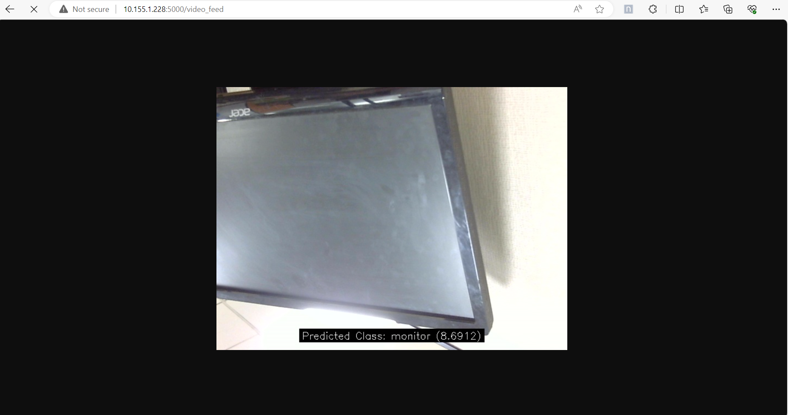
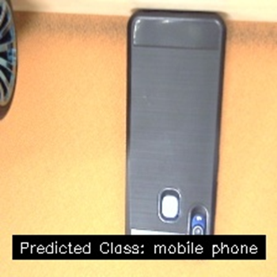

## Introduction

In today's digital world, the demand for smart applications capable of analyzing and understanding images is rapidly growing. At the forefront of this transformation is the Vision Transformer (ViT) model, an innovative approach to image classification. ViT models utilize a self-attention mechanism that allows them to capture global context and intricate patterns across an entire image.

ViT models have demonstrated exceptional performance in a variety of domains. In autonomous driving, ViT models enhance the ability of vehicles to recognize and react to their surroundings with greater accuracy and speed. In the field of medical imaging, ViT models assist in the early detection and diagnosis of diseases by analyzing complex medical images more effectively than traditional methods. Moreover, in security and surveillance, ViT models improve the accuracy of identifying and tracking objects or individuals in real-time.
In this approach a machine learning model called ViT is capable of classifying pictures from the Imagenet dataset.


- Model Type
: Image classification
- Checkpoint
: Trained on Imagenet 
- Input Resolution
: 224x224 pixels
- Number of Parameters
: 86.6 million
- Model Size
: 330 MB

## Prerequisites 
 
- python3.8 
- Ubuntu 20.04
- Conda Environment
- RB5

### Step1: Install Conda on wsl2 by using the below given link.

https://thesecmaster.com/step-by-step-guide-to-install-conda-on-ubuntu-linux/

•	After Installation, create the conda environment by using the given commands.

    $ conda create --name <env_name> python=3.8
•	To check the conda environment list

    $ conda env list

•	To activate conda environment

    $ conda activate “env_name”

### Step2: Install the required dependencies for Vision Transformer (ViT) TfLite model inference.
```sh 
    $ pip install -r requirements.txt
```

### Step3: Download ViT TfLite model from Qualcomm AI Hub website and save it in model folder. Use the below link to download.

https://aihub.qualcomm.com/models/vit
 
### Continuous image inferencing from the RB5 camera using VIT TFLite model

```sh 
    $ python continuous_infer.py --feed
```
on <ip_rb5:5000>



###  Capturing a single image from the RB5 camera, performing inference, and generating a classified image.

```sh
    $ python continuous_infer.py --camera 
``` 




### Performs inference on default image

```sh
    $ python continuous_infer.py 
```


